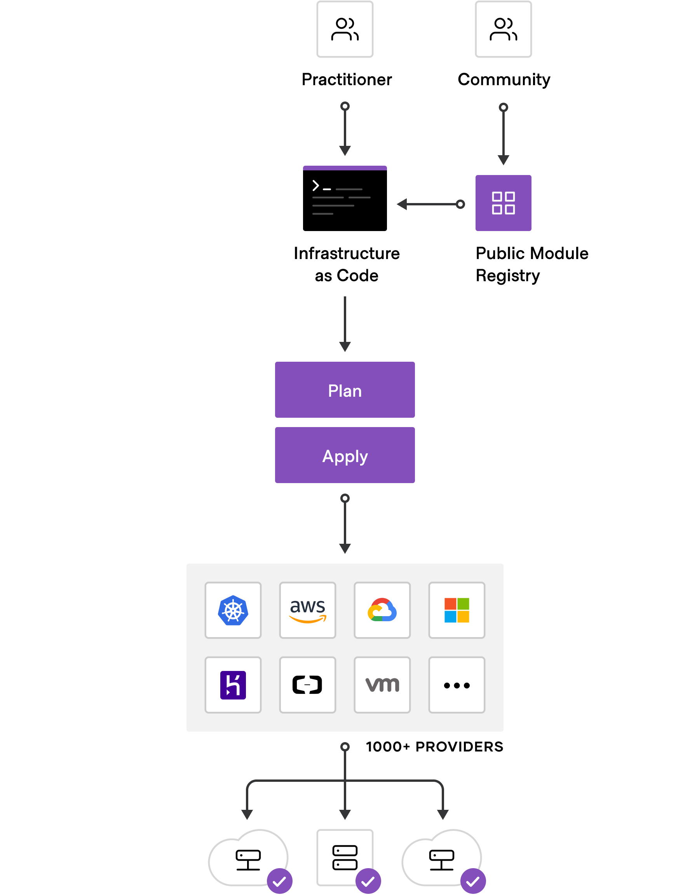

# Terraform

## What is Terraform?


Open-source Infrastructure as Code software tool which provides a consistent CLI (command line interface) workflow to manage cloud services. Terraform codifies cloud APIs (application programming interface) which is a software intermediary that allows two applications to talk to each other.
### Write
Write infrastructure as code using declarative configuration files. HashiCorp Configuration Language (HCL) allows for concise descriptions of resources using blocks, arguments and expressions

### Plan
Run terraform plan to check whether the execution plan for a configuration matches your expectations before provisioning or changing infrastructure.

### Apply
Apply changes to hundreds of cloud providers with terraform apply to reach the desired state of the configuration.

## Purpose of Terraform

## Benefits
- Lightweight meaning it doesnt slow down your machine
- Cloud Independant so it will connect to any cloud using modules
- Open-source so no costs for use
- Simple language close to JSON which means no indentation issues

## Usage
Running `Terraform` in the command line brings up all the usage for Terraform
```
Main commands:
  init          Prepare your working directory for other commands
  validate      Check whether the configuration is valid
  plan          Show changes required by the current configuration
  apply         Create or update infrastructure
  destroy       Destroy previously-created infrastructure

All other commands:
  console       Try Terraform expressions at an interactive command prompt
  fmt           Reformat your configuration in the standard style
  force-unlock  Release a stuck lock on the current workspace
  get           Install or upgrade remote Terraform modules
  graph         Generate a Graphviz graph of the steps in an operation
  import        Associate existing infrastructure with a Terraform resource
  login         Obtain and save credentials for a remote host
  logout        Remove locally-stored credentials for a remote host
  output        Show output values from your root module
  providers     Show the providers required for this configuration
  refresh       Update the state to match remote systems
  show          Show the current state or a saved plan
  state         Advanced state management
  taint         Mark a resource instance as not fully functional
  test          Experimental support for module integration testing
  untaint       Remove the 'tainted' state from a resource instance
  version       Show the current Terraform version
  workspace     Workspace management

Global options (use these before the subcommand, if any):
  -chdir=DIR    Switch to a different working directory before executing the
                given subcommand.
  -help         Show this help output, or the help for a specified subcommand.
  -version      An alias for the "version" subcommand.
```
## Setting up Terraform
To begin using Terraform we need to create some environmental variables on your system.
`Windows > Edit the system environmental variables > Environmental Variables > Add `
You will need to add two variables:
- AWS_ACCESS_KEY_ID
- AWS_SECRET_ACCESS_KEY

To start using Terraform we need to create a file names `main.tf`
- Add the code to initialise terraform with provider AWS
```
provider "aws"{
	region = "eu-west-1"

}
```
- Run this code with `terraform init`
- If successful:
```
Terraform has been successfully initialized!

You may now begin working with Terraform. Try running "terraform plan" to see
any changes that are required for your infrastructure. All Terraform commands
should now work.
```
- You will also notice the creation of two fles `.terraform` and `.terraform.lock.hcl` which should be added to a git ignore.


## Creating Resources on AWS

Lets start by launching an EC2 instance using our app AMI
```
resource "aws_instance" "app_instance" {
    ami = "ami-ID"
    instance_type = "t2.micro"
    associate_public_ip_address = true
    tags = {
        Name = "SRE_kieron_terraform_app"
    }
}
```
To run this new code `terraform plan` if successful run `terraform apply`
This will prompt the user to enter `yes` to build the EC2 instance
- You should see the following:
```
aws_instance.app_instance: Creating...
aws_instance.app_instance: Still creating... [10s elapsed]
aws_instance.app_instance: Still creating... [20s elapsed]
aws_instance.app_instance: Still creating... [30s elapsed]
aws_instance.app_instance: Creation complete after 33s [id=i-0ed97ab41a2475e91]

Apply complete! Resources: 1 added, 0 changed, 0 destroyed.
```
Once completed you can head over to the cloud provider, here is AWS and check out the new instance
